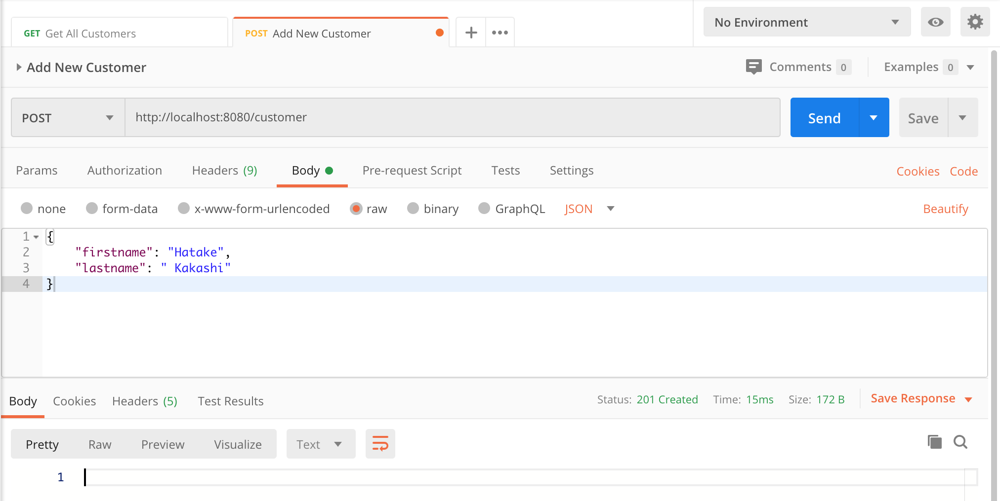
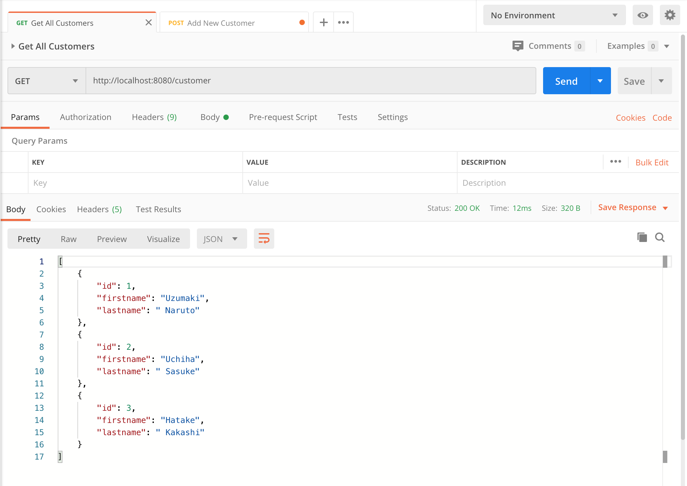
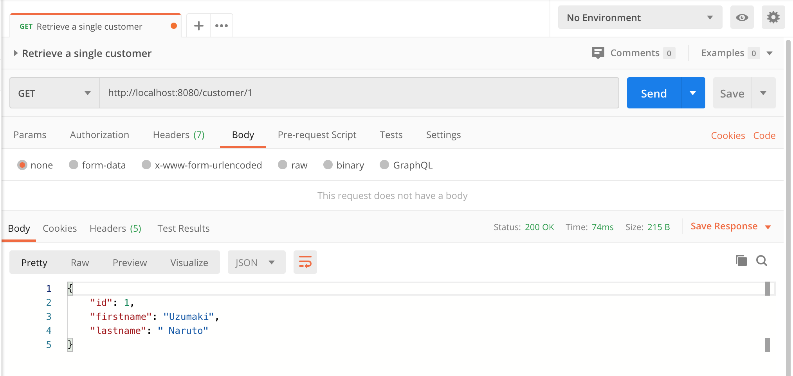
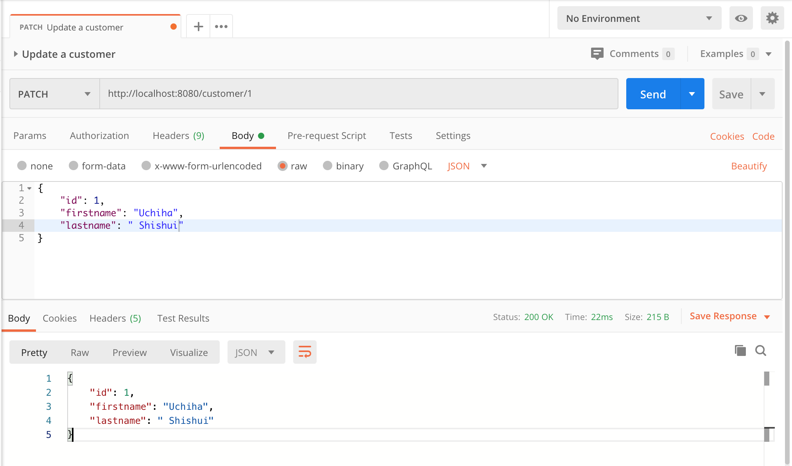
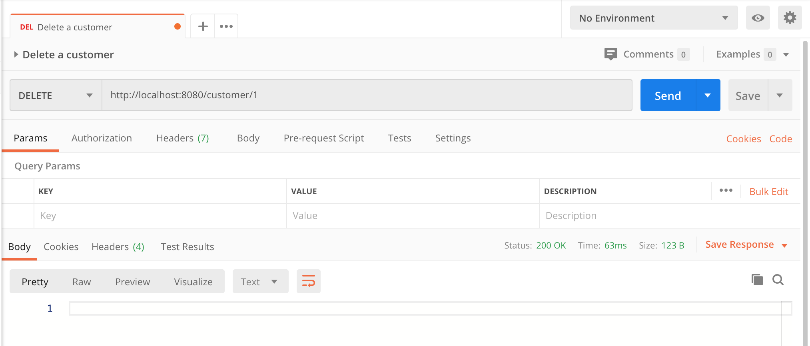

# Spring Boot RESTFul Web Service Example

It's a sample web service application for Spring Boot Web Service. It has a Custome entity and CRUD operation as web service.

## Things to do list:
1. Clone this repository: `git clone https://github.com/hendisantika/spring-boot-rest.git`.
2. Go to folder: `cd spring-boot-rest`.
3. Run the application: `mvn clean spring-boot:run`.
4. Open [POSTMAN](https://www.postman.com/downloads/) App.
5. Import Postman Collection.

## Screen shot

Add New Customer

List All Customers

Filter Customer by Id

Patch Customer Data

Delete Customer Data

 
